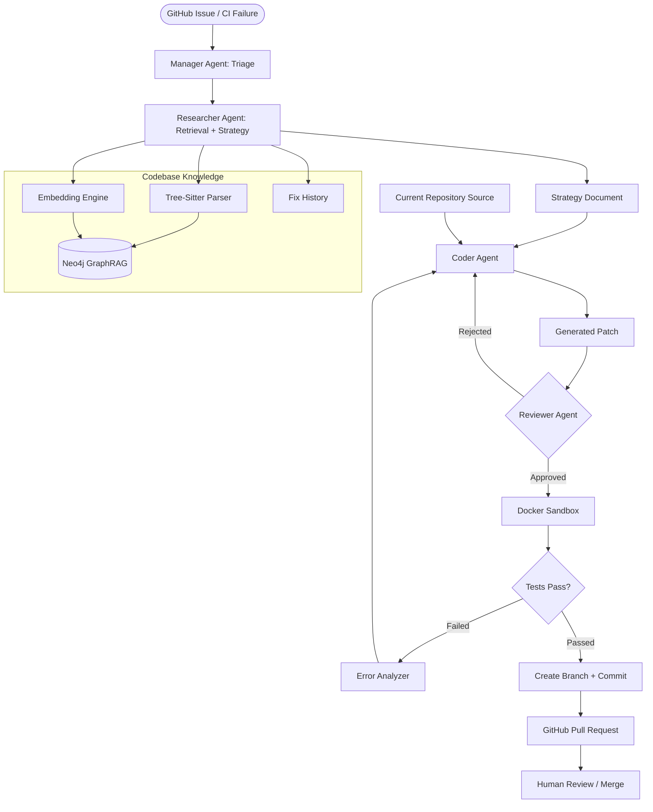
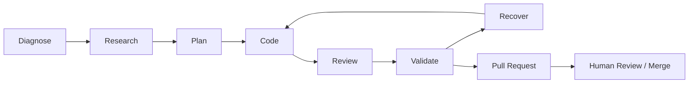
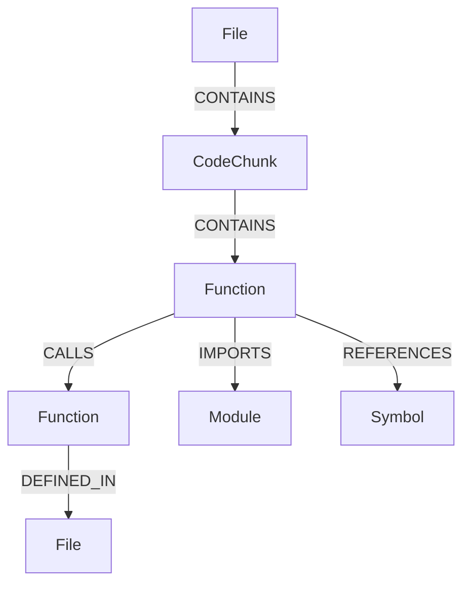
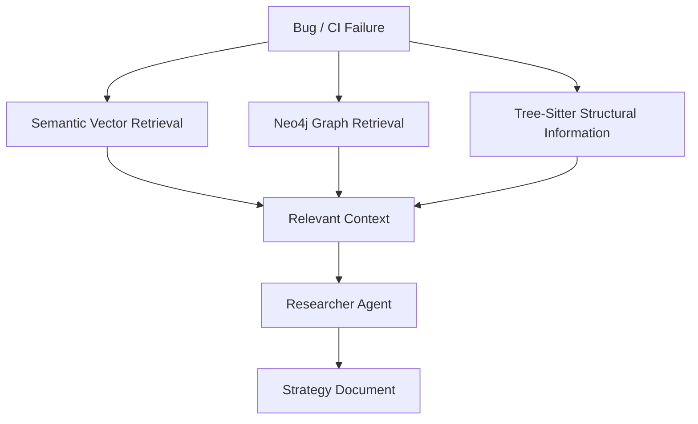

# Zenith — Loop Engineering Platform for Autonomous AI Software Development

Zenith is an autonomous AI software engineering system that goes beyond simple code generation. It runs a bounded engineering loop to investigate GitHub Issues and CI/CD failures, research the repository, generate fixes, review them, validate them, recover from failures, and create Pull Requests for human review.

The core loop is:

**Diagnose → Research → Plan → Code → Review → Validate → Recover**

By combining **LangGraph state orchestration**, **Neo4j GraphRAG**, **Tree-Sitter code parsing**, **repository-aware retrieval**, and **Docker validation**, Zenith turns code generation into a feedback-driven software engineering workflow.

---
## 🧪 Test Repository

Zenith is tested against a dedicated target repository containing controlled, reproducible regressions to validate its autonomous bug-fixing workflow.

**Test Repository:** [zenith-test](https://github.com/vivek-c29/zenith-test)
---
## 🔄 Engineering Loop Architecture

Zenith operates as a stateful multi-agent workflow. The important part is not only generating a patch, but validating the proposed change and feeding failures back into the loop when necessary.



---

## 🧭 How Zenith Works

The complete engineering lifecycle can be viewed as seven major stages:



---

## 🧭 How Zenith Works

The engineering lifecycle can be understood as:

```text
Diagnose → Research → Plan → Code → Review → Validate
                                      ↑           |
                                      └─ Recover ─┘
```

A failed reviewer decision or failed runtime validation does not immediately terminate the task. The system can return to the Coder with additional feedback, subject to a bounded iteration limit.

---

# 1. 🎯 Intake & Triage — Manager Agent

Zenith supports two primary entry points:

- GitHub Issues
- CI/CD test failures

The Manager analyzes the incoming problem and converts it into structured information.

Typical information includes:

- error type
- error message
- failed test information
- suspected files
- suspected functions
- possible root cause
- repository context
- execution information

The Manager's responsibility is **problem understanding and structuring**, not code generation.

```text
GitHub Issue / CI Failure
            ↓
          Manager
            ↓
Structured Problem State
            ↓
        Researcher
```

---

# 2. 🔎 Contextual Research — Researcher Agent

The Researcher gathers repository context using multiple sources:

- Tree-Sitter structural information
- semantic/vector retrieval
- Neo4j graph relationships
- historical fixes
- current repository information

These inputs are combined into a **Strategy Document** that guides the Coder.

```text
Problem State
     ↓
Researcher
     ↓
Repository Context
     ↓
Strategy Document
     ↓
Coder
```

The Strategy Document acts as the bridge between repository investigation and code generation.

---

# 3. 🧠 Codebase Understanding with GraphRAG

Zenith combines semantic retrieval with structural repository information.

## Tree-Sitter

Tree-Sitter parses supported source files and extracts information such as:

- functions
- classes
- methods
- symbols
- imports
- code chunks
- call relationships
- containment relationships

This gives Zenith structural information about the repository instead of treating source files as plain text only.

## Embeddings

Zenith uses:

```text
BAAI/bge-small-en-v1.5
```

to generate vector representations for repository code and historical fixes.

## Neo4j GraphRAG

Neo4j provides the graph-backed knowledge layer used to represent relationships between indexed code elements.

A simplified repository relationship is:

```text
File → CONTAINS → CodeChunk → CALLS → CodeChunk
```



This allows repository relationships to complement semantic retrieval.

## Hybrid Retrieval

Zenith combines:

```text
Semantic Retrieval
       +
Graph Retrieval
       +
Tree-Sitter Structure
       +
Historical Fixes
       ↓
Relevant Repository Context
       ↓
Researcher
```

The purpose is to give the Researcher multiple sources of context before a fix strategy is generated.

---

# 4. 📋 Strategy Document

The Researcher converts the gathered evidence into a Strategy Document.

It provides the Coder with information such as:

- problem interpretation
- relevant files and code
- suspected root cause
- proposed fix strategy
- validation considerations

The important separation is:

```text
Repository Research → Strategy Document → Code Generation
```

This keeps repository investigation separate from the actual modification step.

---

# 5. 👨‍💻 Code Generation — Coder Agent

The Coder generates structured patches rather than directly modifying the repository.

A patch follows the:

```text
search_text → replace_text
```

model.

Example:

```json
{
  "file_path": "buggy_math.py",
  "search_text": "    return a - b",
  "replace_text": "    return a + b"
}
```

The generated `search_text` must match the current source exactly.

---

# 6.  📌 Live Source Grounding

RAG helps Zenith identify relevant files and code relationships, but the **current repository source is authoritative for modification**.

```text
RAG / Research
      +
Strategy + Feedback
      +
Current Repository Source
      ↓
    Coder
      ↓
Structured Patch
```
---

# 7. 🛡️ Patch Validation

LLM-generated patches are treated as proposals rather than trusted modifications.

Before applying a patch, Zenith checks:

```text
Target file exists
        ↓
Search text exists
        ↓
Exactly one match
        ↓
Replacement changes file
        ↓
Path stays inside repository
        ↓
Patch accepted
```

These checks prevent:

- invalid file targets
- missing search text
- ambiguous replacements
- silent no-op modifications
- unsafe repository paths

The same patch application logic is used during:

- Docker sandbox validation
- Pull Request creation

---

# 8. 🔍 Reviewer Agent

The Reviewer independently inspects the generated patch.

It evaluates whether:

- the patch addresses the intended problem
- the change is reasonable
- obvious issues are present
- the patch should be classified as `LOW` or `HIGH` risk

The decision creates two possible paths:

```text
Patch
 ↓
Reviewer
 ├── Reject → Feedback → Coder
 └── Approve → Docker Sandbox
```

Reviewer approval is not treated as proof of runtime correctness. Runtime validation happens separately inside the Docker Sandbox.

---

# 9. 🐳 Docker Validation Sandbox

After Reviewer approval, Zenith validates the proposed change inside an isolated Docker environment.

The validation flow is:

```text
Temporary Repository Copy
          ↓
      Apply Patch
          ↓
    Docker Container
          ↓
   Install Test Tools
          ↓
 Run Configured Test Command
          ↓
 Capture exit code/stdout/stderr
          ↓
       Test Result
```

The default sandbox image is:

```text
python:3.12-slim
```

Zenith captures:

- test exit code
- `stdout`
- `stderr`

The result determines whether the workflow proceeds toward Pull Request creation or enters the recovery path.

---

# 10. 🔁 Diagnostic Recovery & Self-Correction

When Docker validation fails, Zenith can analyze the failure instead of immediately stopping.

```text
Docker Sandbox
      ↓
   Tests Fail
      ↓
 Error Analyzer
      ↓
 Failure Diagnosis
      ↓
     Coder
      ↓
 New Patch
```


The diagnosis can use information such as:

- failing test
- exception
- stack trace
- standard output
- standard error
- exit code

The workflow is bounded by a configurable maximum iteration count to prevent indefinite autonomous loops.

---

# 11. 🧾 Structured LLM Response Recovery

Certain Zenith operations expect structured JSON from the LLM.

Because model responses may occasionally be malformed or unexpectedly formatted, Zenith includes recovery handling for invalid structured responses.

The simplified behavior is:

```text
LLM Request
    ↓
LLM Response
    ↓
Valid Structured Output?
   ├── Yes → Continue
   └── No  → Retry / Recovery
```

This provides an additional reliability layer around structured agent operations.

---

# 12. 🚀 CI/CD Workflow

Zenith can operate as an autonomous recovery layer around an existing GitHub Actions workflow.

The overall lifecycle is:

```text
Developer Push
      ↓
GitHub Actions
      ↓
Run Tests
      ↓
Tests Fail
      ↓
Zenith Activated
      ↓
Manager → Researcher → Coder → Reviewer
      ↓
Docker Validation
      ↓
Tests Pass
      ↓
Pull Request
      ↓
Human Review / Merge
```

Zenith is therefore not replacing CI/CD. It is used as a repair workflow when the existing validation process reports a failure.

---

# 13. 🐛 GitHub Issue Workflow

Zenith also supports a reactive workflow triggered by a GitHub Issue.

The issue title and body are passed to Zenith as a bug report.

```text
GitHub Issue
     ↓
Zenith CLI
     ↓
Manager
     ↓
Researcher
     ↓
Coder
     ↓
Reviewer
     ↓
Docker Sandbox
     ↓
Pull Request
     ↓
Human Review / Merge
```

This provides an entry point for bugs that are reported by developers but may not yet be detected by automated CI tests.

---

# 14. 👤 Human-in-the-Loop

Zenith intentionally stops at Pull Request creation rather than automatically merging generated code.

```text
AI Investigation
      ↓
AI Code Generation
      ↓
AI Review
      ↓
Automated Validation
      ↓
Pull Request
      ↓
Human Review
      ↓
Human Merge
```

Zenith automates:

- repository investigation
- retrieval
- code generation
- patch review
- test execution
- failure analysis
- Pull Request creation

The final merge decision remains with a human reviewer.

---

# 15. 🌿 Git & GitHub Integration

After successful validation, Zenith performs the delivery workflow:

```text
Validated Patch
      ↓
Create Fix Branch
      ↓
Apply Patch
      ↓
Create Commit
      ↓
Push Branch
      ↓
Open Pull Request
      ↓
Human Review
```

Example branch format:

```text
zenith/fix-<id>
```

The Pull Request is opened against the configured base branch.

---

# 🧩 Technology Stack

| Component | Technology |
|---|---|
| Agent Orchestration | LangGraph |
| LLM Integration | LangChain + OpenRouter |
| Code Parsing | Tree-Sitter |
| Embeddings | `BAAI/bge-small-en-v1.5` |
| GraphRAG | Neo4j |
| Retrieval | Hybrid Vector + Graph Retrieval |
| Validation | Docker |
| Testing | Pytest |
| Version Control | Git |
| Repository Automation | GitHub |
| CI/CD | GitHub Actions |
| Logging | Loguru |

---

# 🏗️ Project Structure

```text
Zenith/
│
├── .github/
│
├── test/
│   ├── test_phase1.py
│   ├── test_phase2.py
│   ├── test_phase3.py
│   ├── test_phase4.py
│   └── test_phase5.py
│
└── zenith/
    │
    ├── agent/
    │   ├── graph.py
    │   ├── nodes.py
    │   ├── prompts.py
    │   └── state.py
    │
    ├── parser/
    │   ├── language_map.py
    │   ├── models.py
    │   └── tree_sitter_parser.py
    │
    ├── vector_store/
    │   ├── embedding_engine.py
    │   ├── indexer.py
    │   ├── vector_store.py
    │   └── neo4j_store.py
    │
    ├── git_manager/
    │   ├── git_manager.py
    │   └── models.py
    │
    ├── github/
    │   └── github_client.py
    │
    ├── sandbox/
    │   └── docker_manager.py
    │
    ├── config/
    │   ├── settings.py
    │   └── logger.py
    │
    └── utils/
        ├── json_utils.py
        └── text_utils.py
```

---

# ⚙️ Setup

## Requirements

- Python 3.12
- Git
- Docker
- Neo4j
- LLM API access
- GitHub credentials for repository operations

## Clone

```bash
git clone https://github.com/vivek-c29/Zenith.git
cd Zenith
```

## Create Virtual Environment

### Windows

```powershell
python -m venv .venv
.venv\Scripts\Activate.ps1
```

### Linux / macOS

```bash
python3 -m venv .venv
source .venv/bin/activate
```

## Install Dependencies

```bash
pip install -r requirements.txt
```

---

# 🔐 Configuration

Create a local `.env` file in the project root:

```env
OPENROUTER_API_KEY=your_openrouter_api_key

LLM_MODEL=your_model_name
LLM_TEMPERATURE=0
LLM_MAX_TOKENS=your_limit

GITHUB_TOKEN=your_github_token

NEO4J_URI=your_neo4j_uri
NEO4J_USERNAME=neo4j
NEO4J_PASSWORD=your_neo4j_password
```

Never commit credentials or `.env` files to Git.

A typical `.gitignore` should include:

```gitignore
.env
.venv/
__pycache__/
*.pyc
.pytest_cache/
.coverage
*.log
```

---

# ▶️ Running Zenith

## CI/CD Regression Mode

Run Zenith against a repository where a test command needs to be investigated after failure:

```bash
python -m zenith.cli \
  --repo path/to/repository \
  --test-command "python -m pytest -x -v" \
  --base-branch main
```

## Reactive Bug-Fix Mode

Run Zenith using a direct bug report:

```bash
python -m zenith.cli \
  --repo path/to/repository \
  --bug-report "Describe the bug here"
```

Example:

```bash
python -m zenith.cli \
  --repo path/to/repository \
  --bug-report "add_numbers should return the sum of the inputs but currently returns their difference"
```

---

# 🛡️ Reliability & Safety

Zenith treats autonomous code modification as a controlled process.

Key safeguards include:

- **Bounded retries** to prevent infinite agent loops
- **Structured LLM response validation** for expected JSON outputs
- **Live-source grounding** for exact patch generation
- **Strict patch validation** before code modification
- **Independent review** before runtime validation
- **Docker-based execution** before Pull Request creation
- **Human-in-the-loop approval** for the final merge

The objective is to validate changes before delivery rather than trusting a generated patch immediately.

---

# 🧪 Validated End-to-End Workflows

Zenith has been validated against a dedicated test repository containing deliberately introduced regressions.

Validated workflows include:

```text
✅ Manual autonomous bug fixing
✅ CI/CD failure → Zenith → Fix → Pull Request
✅ GitHub Issue → Zenith → Fix → Pull Request
✅ Neo4j GraphRAG repository retrieval
✅ Tree-Sitter code parsing
✅ Current-source grounding
✅ Patch validation
✅ Docker-based test execution
✅ Error analysis and bounded retries
✅ Human-in-the-loop Pull Requests
```

A compact representation of the validated workflow is:

```text
Bug / CI Failure
      ↓
Diagnosis
      ↓
Repository Research
      ↓
Patch Generation
      ↓
Patch Review
      ↓
Docker Validation
      ↓
 ┌───────────────┐
 │               │
Pass           Fail
 │               │
 ↓               ↓
PR          Error Analysis
 │               │
 ↓               └──→ Coder
Human Review
```


---

# 🔮 Future: Productionizing Zenith

The current core agent can be turned into a reusable developer platform with a thin integration layer:

- **Hosted Zenith Service** — Run the agent, LLM integration, and GraphRAG infrastructure as a managed backend instead of requiring local setup.
- **GitHub App Integration** — Connect repositories through a GitHub App to automatically receive CI failures and Issues, investigate them, and create Pull Requests.
- **Repository Configuration** — Support a lightweight `zenith.yml` for settings such as test command, base branch, and validation options.
- **Managed Secrets & Permissions** — Keep LLM/GraphRAG credentials and repository access centrally managed with scoped permissions.
- **Scalable Workers** — Run Docker validation and agent tasks as isolated background jobs for multiple repositories.

This would preserve the existing agent core while making Zenith usable as a developer-facing service.

---

# 🎯 Core Engineering Principle

Zenith is built around a simple engineering idea:

```text
Don't just generate code.
Investigate it.
Review it.
Run it.
Validate it.
Learn from failures.
Retry within bounds.
Then ask a human to approve the change.
```

The goal is to automate repetitive software-engineering work while maintaining a clear validation process and a human approval boundary before code is merged.