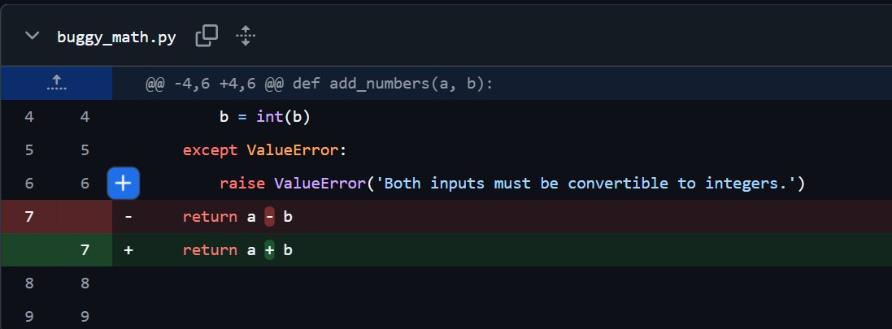
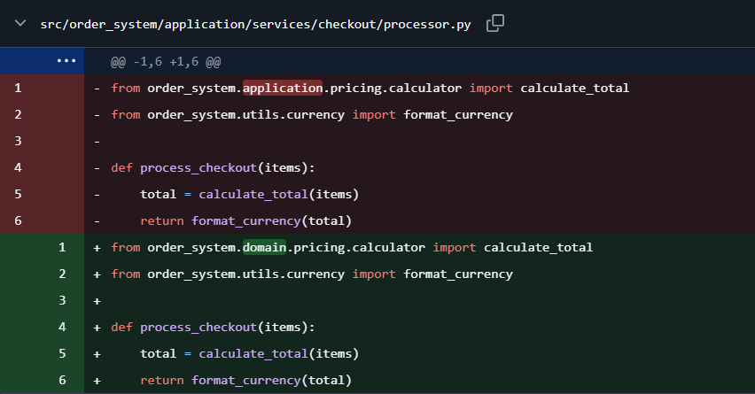

# Zenith-Test — Autonomous Bug-Fix Test Repository

`zenith-test` is a **controlled target repository used to test and demonstrate Zenith**, the autonomous AI software engineering agent.

The repository is intentionally kept small and is **deliberately modified with reproducible regressions** so that Zenith can investigate real repository-level failures instead of solving only isolated code snippets.

Currently, two dedicated scenarios have been used to demonstrate Zenith's repair workflow:

1. **Arithmetic regression** — an incorrect addition implementation.
2. **Nested cross-file import regression** — an incorrect import inside a nested package structure.

In both cases, Zenith was used to investigate the failure, identify the relevant code, generate a fix, review it, validate it in Docker, and create a Pull Request.

---

## 🧪 Test Scenario 1 — Arithmetic Regression

The first scenario uses `buggy_math.py` and its corresponding tests.

A deliberate regression was introduced so that the addition function returned the wrong result.

```text
Failing Test
    ↓
Zenith Investigation
    ↓
Identify Incorrect Implementation
    ↓
Generate Fix
    ↓
Review
    ↓
Docker Validation
    ↓
Pull Request
```

Zenith successfully restored the expected addition behavior.

### 📸 Zenith Fix



The screenshot above shows the code correction produced through the Zenith workflow.

---

## 🧪 Test Scenario 2 — Nested Cross-File Import Regression

The second scenario is intentionally more repository-oriented.

A small checkout flow was created using a nested package structure:

```text
tests/test_checkout.py
        ↓
application/services/checkout/processor.py
        ↓
domain/pricing/calculator.py
        ↓
utils/currency.py
```

A deliberate import regression was then introduced in `processor.py`.

### Broken Import

```python
from order_system.application.pricing.calculator import calculate_total
```

The actual calculator module exists under the domain package:

```python
from order_system.domain.pricing.calculator import calculate_total
```

The incorrect import caused:

```text
ModuleNotFoundError:
No module named 'order_system.application.pricing'
```

Zenith then processed the failure through its repository-aware workflow:

```text
Import Failure
      ↓
Manager
      ↓
Researcher + GraphRAG
      ↓
Relevant Nested Files
      ↓
Coder
      ↓
Import Fix
      ↓
Reviewer
      ↓
Docker Validation
      ↓
Tests Pass
```

Zenith successfully identified the relevant nested files and restored the correct import.

### 📸 Zenith Fix



The screenshot above shows the corrected import generated through the Zenith workflow.

---

## 🎯 Why These Tests Exist

The individual bugs are intentionally small, but the repository structure is designed to test whether Zenith can reason about **code relationships and repository context**.

The nested checkout scenario, for example, requires understanding the relationship between:

```text
Test
 ↓
Checkout Processor
 ↓
Pricing Calculator
```

This makes the repository useful for testing features such as:

- Tree-Sitter code parsing
- Neo4j GraphRAG
- semantic retrieval
- cross-file repository understanding
- live-source grounding
- structured patch generation
- patch validation
- Docker-based validation

---

## 🧩 Repository Structure

```text
zenith-test/
│
├── .github/
│   └── workflows/
│       ├── zenith-ci.yml
│       └── zenith-issues.yml
│
├── src/
│   └── order_system/
│       ├── application/
│       │   └── services/
│       │       └── checkout/
│       │           └── processor.py
│       │
│       ├── domain/
│       │   └── pricing/
│       │       └── calculator.py
│       │
│       └── utils/
│           └── currency.py
│
├── tests/
│   ├── test_checkout.py
│   ├── test_math.py
│   └── test_sync.py
│
├── buggy_math.py
├── pinecone_client.py
├── sync_manager.py
├── pyproject.toml
├── .gitignore
└── README.md
```

---

## ⚙️ Pytest Configuration

The repository uses a `src/` layout.

`pyproject.toml` contains:

```toml
[tool.pytest.ini_options]
pythonpath = ["src"]
```

This allows the tests to import the application package correctly and keeps the test setup reproducible in environments such as the Docker validation sandbox.

---

## ▶️ Running the Tests

From the repository root:

```bash
python -m pytest -x -v
```

A healthy repository should complete with all tests passing.

---

## 🤖 Using Zenith with This Repository

Zenith can be run against this repository in either CI/CD regression mode or reactive bug-fix mode.

### CI/CD Regression Mode

```bash
python -m zenith.cli \
  --repo path/to/zenith-test \
  --test-command "python -m pytest -x -v" \
  --base-branch main
```

### Reactive Bug-Fix Mode

```bash
python -m zenith.cli \
  --repo path/to/zenith-test \
  --bug-report "Describe the bug here"
```

The GitHub Actions workflows in this repository provide automated entry points for CI failures and reported issues, while the main Zenith repository documents the complete workflow and architecture.

---

## 🛡️ Controlled Testing Approach

The regressions in this repository are **intentionally introduced for testing Zenith**.

The basic testing pattern is:

```text
Clean Implementation
        ↓
Expected-Behavior Tests
        ↓
Verify Baseline
        ↓
Introduce Controlled Regression
        ↓
Run Zenith
        ↓
Validate Generated Fix
```

The deliberate bug and the resulting fix are preserved in Git history so the repair scenarios can be reproduced and inspected.

---

## 🔗 Related Project

This repository is the target/test environment for:

**Zenith — Autonomous AI Software Engineering Agent**

Main repository:

https://github.com/vivek-c29/Zenith

Zenith contains the multi-agent orchestration, repository retrieval, patch generation, validation, GitHub integration, and recovery logic used to investigate and repair the regressions demonstrated here.